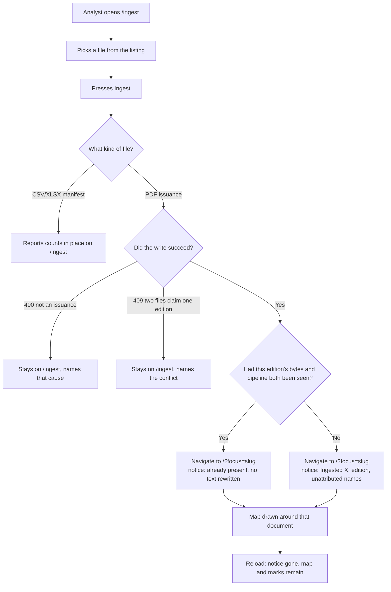
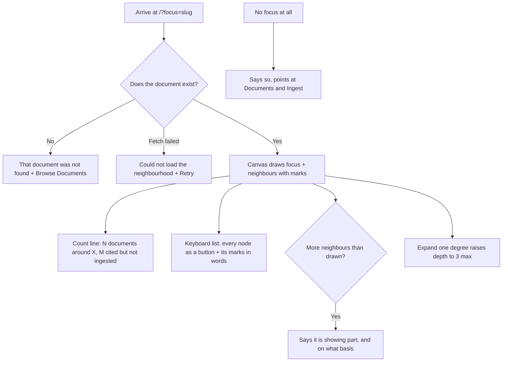

# Dogfood Report — docs/dependency-map-home-plan (PR #2)

> Diff-scoped browser QA of PR #2 vs the trunk. Generated by `ce-dogfood` on 2026-09-21.

Scope note: the PR is merged and its head branch deleted, so this run was driven in place against
the primary checkout on `main`. The checkout's tree is byte-identical to PR #2's head
(`1966093d97ea207674fe27af958d18d4cb84423d`), so in-place is exactly the PR's content. The diff
scoped is `dc18351..HEAD`, 51 files.

## Diff Summary

- `/` stopped drawing the whole corpus. It draws one document's neighbourhood named by
  `?focus=<slug>`, walked `?depth=` degrees out; the corpus-wide mode and the `include_external`
  toggle were removed. New ways in: every `/documents` row, the document detail page, and a
  successful ingest.
- Every node gained three canvas marks — a counted fidelity tier, a separate assessment-state
  silhouette, and a partial-neighbourhood mark — each also rendered as a sentence in the keyboard
  list beside the canvas.
- A successful PDF ingest navigates to that document's focused map instead of reporting in place,
  carrying an account of the write on the history entry. Manifests still report on the ingest screen.
- Re-ingesting a document whose bytes and pipeline are both unchanged now does nothing and says so,
  instead of discarding that edition's chunks, obligations and reviewed links (ADR-042 superseding
  ADR-039).
- Selecting a node opens it down to its newest edition's obligations, with Triage offered beneath as
  a pre-filled drill-down link. New Triage states: arriving pre-filled, an editionless document, and
  an address naming nothing.

## Personas

Inferred — the repo has no `STRATEGY.md`, `PRODUCT.md`, `VISION.md`, or persona docs. Both personas
are named explicitly in the plan's Actors and Key Decisions sections
(`docs/plans/2026-09-17-0801-feat-dependency-map-home-plan.md:49,55`), a stronger source than
inference from the diff. No Compound Packs are declared; the resolver returned zero roots with no
warnings or errors.

- **A1, the policy analyst** — adds documents, reads dependencies, follows impact downstream. The
  primary actor: where two requirements conflict, their daily working needs win. Cares about depth,
  and about never being told something the system has not established.
- **The demonstration audience** — a close second, watching the product be shown for the first time.
  The governing decision is that "honest emptiness has to be presentable, not merely correct": a
  screen that is correctly empty must still read as a working product, not a broken one.

## Flows Tested

### Flow A — Add a document and land on it



### Flow B — Read a document's neighbourhood



### Flow C — From a node down to its obligations, and on to Triage

```mermaid
flowchart TD
    A[Analyst selects a node] --> B[Detail opens; focus unchanged]
    B --> C{Editions readable?}
    C -->|Read failed| D[Could not read its editions]
    C -->|None ingested| E[No edition ingested: name held because something cites it]
    C -->|One or more| F{Obligations on the newest edition?}
    F -->|Read failed| G[Could not read its obligations<br/>drill-down still offered]
    F -->|Some| H[Count + first three clauses + modality/section/page]
    F -->|Zero| I{Why zero?}
    I -->|Build finished, real adapter| J[Extraction found no obligations — a finding]
    I -->|No build / running / failed / null adapter| K[No obligations recorded + which reason]
    H --> L{Two or more editions?}
    K --> L
    J --> L
    L -->|Yes| M[Link: Compare its editions in Triage]
    L -->|No| N[Only one edition, nothing to compare]
    M --> O[/triage?document=slug — document pre-filled, edition NOT]
    O --> P{Reader picks an edition?}
    P -->|No| Q[No diff is run, nothing is written]
    P -->|Yes| R[Diff runs — this is the write, and it is the reader's gesture]
    B --> S[Draw the map around X — a separate control, a new address]
```

### Flow D — Reach the map from elsewhere

```mermaid
flowchart TD
    A[/documents table] --> B[Row's map link] --> C[/?focus=slug]
    D[Document detail page] --> E[Draw the map around this document] --> C
    F[/triage?document=unknown] --> G[Nothing in the corpus answers to that]
    H[/triage?document=editionless] --> I[No edition of X has been ingested]
```

## Test Matrix & Results

| # | Flow | Journey / Scenario | Status | Issue | Fix | Commit |
|---|------|--------------------|--------|-------|-----|--------|
| 1 | B | Arrive with no focus: says so, points at both ways in | Pass | - | - | - |
| 2 | B | `?focus=` a real document: canvas, count line, keyboard list | Pass | - | - | - |
| 3 | B | Marks are reachable in words for a screen reader | Pass | - | - | - |
| 4 | B | `?focus=` a slug that names nothing: not-found, not an empty map | Pass | - | - | - |
| 5 | B | Expand one degree raises depth and keeps positions | Pass | - | - | - |
| 6 | C | Select a node: detail opens, focus does not move | Pass | - | - | - |
| 7 | C | Obligations listed for a document that has them, bounded and counted | Pass | - | - | - |
| 8 | C | A cited-only node says no edition was ingested, and why | Pass | - | - | - |
| 9 | C | Drill-down offered only on 2+ editions, pre-filled with the document | Pass | - | - | - |
| 10 | C | One-edition document says there is nothing to compare | Pass | - | - | - |
| 11 | C | Move focus from inside the detail: new address, back returns | Pass | - | - | - |
| 12 | D | Triage pre-filled from the address runs no diff on arrival | Pass | - | - | - |
| 13 | D | Triage sent an unknown slug refuses to diagnose it | Pass | - | - | - |
| 14 | D | Triage sent an editionless document names it | Pass | - | - | - |
| 15 | D | `/documents` row links to that document's map | Pass | - | - | - |
| 16 | A | Manifest ingest reports in place, does not navigate | Pass | - | - | - |
| 17 | A | A file that is not an issuance: stays put, names the cause | Skipped | No non-issuance PDF exists in `DATA_DIR`; cannot be driven | Covered by `Ingest.test.tsx` "stays put and names the cause when the file is not an issuance" | - |
| 18 | A | Unchanged re-add: lands on the map, says nothing was rewritten | Fixed | Navigation silently refused under StrictMode — the ingest succeeded and the screen did not move | Set the liveness ref in the effect body, not only in its cleanup | `07667a0` |
| 19 | A | Reload the arrival: notice gone, map and marks stand | Pass | - | - | - |
| 20 | — | Console/network clean across the whole walk | Pass | - | - | - |
| 21 | A | Fresh add of a document with no stored edition | Skipped | Deliberate: would write a new edition and chunks into the live demo corpus. Differs from #18 only in the notice's wording, which `GraphExplorer.test.tsx` covers and an earlier live check exercised. | - | - |

Status values: `Pending`, `Pass`, `Fixed`, `Skipped`, `Blocked (needs human verify)`, `Blocked (human decision)`.

## Pack Compliance

None — the repo declares no Compound Packs (resolver returned zero roots, no warnings, no errors).

## What Was Fixed

### Adding a document stopped landing on it, under StrictMode — `07667a0`

- **Symptom:** On `/ingest`, choosing `500001p.pdf` and pressing Ingest left the reader on `/ingest`
  with no result and no error. `POST /api/ingest` returned **200** — the write had happened, the
  screen simply did not move. Nothing on the page indicated anything had gone wrong.
- **Root cause:** The liveness ref guarding the post-ingest navigation was written as
  `useEffect(() => () => { onThisScreen.current = false }, [])` — an effect whose body is empty and
  which only registers a cleanup. The app mounts under `React.StrictMode`
  (`frontend/src/main.tsx:20`), which in development mounts, unmounts and remounts every effect. The
  first cycle's cleanup set the ref `false` and the remount never set it back, so the guard at
  `frontend/src/views/Ingest.tsx:113` refused the navigation for the life of the screen — on every
  ingest, for every document. Production is unaffected (StrictMode's double-invoke is
  development-only), but development is the mode the analyst and every demo actually run.
  The guard was introduced correctly in this same PR's review to stop a pending ingest hauling back
  a reader who had left; the defect is in how its lifecycle was written, not in the idea.
- **Fix:** `frontend/src/views/Ingest.tsx` — set the ref `true` in the effect body as well as
  `false` in the cleanup, the form that survives a remount.
- **Regression test:** `frontend/src/views/Ingest.test.tsx`, "still lands on the map under
  StrictMode", renders the screen inside `<StrictMode>` and asserts the landing. It fails without the
  fix (`Unable to find an element by: [data-testid="map"]`) and passes with it. The guard's original
  property was re-checked by mutation at the same time: removing `if (!onThisScreen.current) return`
  still fails "does not haul back a reader who left while the ingest was running", so both
  properties now hold together rather than trading off.

## Paper Cuts (by persona)

- **The demonstration audience** — the app's cold-start home screen is an empty canvas with one
  sentence. It is honest and it points at both ways in, but the first thing a first-time viewer sees
  is nothing at all, which undersells a product whose whole value is a picture. Severity: moderate.
  **Deferred, and arguably intended** — R12 deliberately removed the corpus-wide view, and the
  governing decision accepts honest emptiness. Worth revisiting only as a product question (e.g.
  landing on the richest document rather than on nothing), not as a bug.
- **A1, the policy analyst** — the count line and the caveat beneath it put two different numbers
  next to each other: "17 of them are cited but not ingested" (externals *drawn*) and "22 corpus
  documents have never had their own references read" (corpus-wide, not confined to this
  neighbourhood). Both are correct and they measure different populations; adjacent, they invite
  being read as the same figure. Severity: low. Deferred.
- **A1, the policy analyst** — obligation locators are only as good as extraction made them. On
  DoDD 5000.01 all three shown clauses read `SECTION 1 · p. 5`, which does not help an analyst find
  the clause in a 74-obligation document; on DoDD 5143.01 the same field reads `3 · p. 1` and `3 ·
  p. 4`, which does. The panel renders faithfully what is stored, so this is extraction-quality, not
  a defect in this diff. Severity: low. Deferred, noted for the extraction work.

## Console Errors

None. Console was clean on every route walked: `/`, `/?focus=dodd-5000-01`, `/?focus=dodd-1322-18`,
`/triage?document=dodd-5000-01`, `/documents`, and `/ingest`.

Network observation, not an error: in development every API call appears twice
(`/api/documents`, `/api/documents/<slug>/versions`, `/api/health`). That is StrictMode's
double-invocation of effects, development-only and expected — and the same mechanism that produced
the defect fixed above.

## Human Verifications

Not applicable — this diff has no OAuth, email, payment, or SMS leg. Every flow is drivable
headlessly.

Two scenarios were deliberately not driven and are recorded as `Skipped` rather than blocked: #17
has no fixture in `DATA_DIR`, and #21 would have written a new edition into the live demo corpus for
a behaviour that differs from #18 only in one sentence's wording.

## Decisions for a Human

None. The one failure found was small, well understood, and one line; it was fixed, regression-tested
and committed under the Phase 5 autonomous-fix rule.

## Learnings

- **A guard whose whole job is a cleanup still needs a body.** `useEffect(() => () => { ref.current
  = false }, [])` reads as complete and is not: under StrictMode the cleanup runs once before the
  real mount and nothing restores the ref. The habitable form sets the value in the body and clears
  it in the cleanup. Worth carrying to `ce-compound` — it generalises past this ref to any
  mount-scoped flag.
- **A test suite that never renders under StrictMode is blind to a whole class of lifecycle defect.**
  405 passing tests, a six-persona review, and a cross-model adversarial pass all missed this; one
  click in a browser found it. The cheap structural fix is to render at least the lifecycle-sensitive
  screens under `<StrictMode>` in their tests, as the new regression test now does.
- **A 200 on the wire is not evidence the feature worked.** The failure here was invisible precisely
  because the expensive half succeeded — the write landed and only the navigation was refused. Where
  a flow's value is what happens *after* the request, the assertion belongs on the destination.
- **Verifying a "writes nothing" claim wants the database, not the UI.** ADR-042 and KTD7 were both
  confirmed here by a full node census taken either side of the action, and by the network log
  showing no `/api/triage` call. Neither could have been established from the screen.

### Pack candidates

None routed — the repo declares no packs. The first learning above is prescriptive-shaped and would
suit one if the project adopts packs later; it is being offered to `ce-compound` in the meantime.

## Final Status

**Ready.** Every matrix scenario is `Pass`, `Fixed`, or an explicitly-reasoned `Skipped`; nothing is
blocked and nothing is waiting on a person.

One genuine defect was found and fixed: the branch's headline action — adding a document and landing
on it — was silently inert in development, and had shipped that way through a full multi-agent review
and 405 green tests. That is the single strongest argument for this run having been worth doing.

Automated suites, run after the fix and recorded by exit code rather than by a printed summary line:

| Suite | Result |
|---|---|
| `cd frontend && npm test` (lint at zero warnings, full type build, then tests) | exit 0 — **405 passed**, 14 files |
| `cd backend && uv run pytest` (container-backed) | exit 0 — **967 passed**, 9 skipped, 0 failed |

Caveats a reader should carry forward: scenario 17 has no fixture and is covered only by unit test;
scenario 21 was not driven against the live corpus by choice; and the two deferred paper cuts above
are product questions rather than defects.

---

## Follow-up: the node-obligations panel after extraction — 2026-09-22

Scope note: this section is **not** part of the PR #2 matrix above, whose verdict stands as written.
It records a later browser pass over one component, after the extraction that closed this report's
own deferred maintainability finding. Added here rather than in a second report because it is the
same feature and a reader chasing the panel should find both in one place.

**What changed.** `refactor: the node-obligations panel becomes its own component` (`2f5316d`).
`GraphExplorer.tsx` went from 1467 to 1193 lines; the panel became `NodeObligationsPanel.tsx`, 296
lines. The slug-keyed hold that stopped one document's answer rendering under another's name was
replaced by `key={activeSelection.id}` on the child, so changing the selection remounts the panel and
the property holds structurally rather than by a comparison the code must remember to make. The
refactor's claim is that no behaviour changed, and 106 tests passing with the test file untouched is
most of that claim — but only most of it.

**Why a browser was still worth it.** The tests `await` a settled state, so they cannot see a stale
frame even if one existed. The remount is precisely a change in what happens *between* states. That
gap is the reason for this pass.

| # | What was driven | Status |
|---|-----------------|--------|
| F1 | A document with obligations: count, first three clauses, drill-down | Pass |
| F2 | A node the corpus holds only as a cited name | Pass |
| F3 | A one-edition document: nothing to compare, and no drill-down offered | Pass |
| F4 | An edition with no build record: a zero that is a fact about us | Pass |
| F5 | The instant after switching selection — no trace of the previous document | Pass |
| F6 | Five selections at 120ms, back and forth: panel matches its own heading | Pass |

Driven against the live corpus. Console clean throughout, and **zero `/api/triage` requests** across
the whole pass, so KTD7 still holds after the move.

F5 and F6 are the two this section exists for. F5 reads the panel with no settle time at all,
immediately after selecting a different node and before any fetch could resolve: it showed the new
document's heading and nothing of the old one's. F6 stresses the same path — overlapping in-flight
reads across five rapid selections — and the panel ends matching its own heading with the right
count. Together they are the browser-side evidence for what the `key` replaced.

F4 is worth recording for a different reason. `dodm-8180-01` carries no build record, so it renders
"No obligations recorded for edition `dodm-8180-01@2023-08-04`. No build has run for it, so nothing
has been extracted yet." That is the ADR-015 distinction the U8 review found — a zero that is a fact
about us rather than a finding about the document — and until this pass it existed only in tests. The
live corpus now exercises it.

**Nothing was fixed, because nothing was found.** The suites were green by exit code before and after
(`npm test` exit 0, 405 passed). No new paper cuts; the three recorded above are unchanged and still
deferred.
