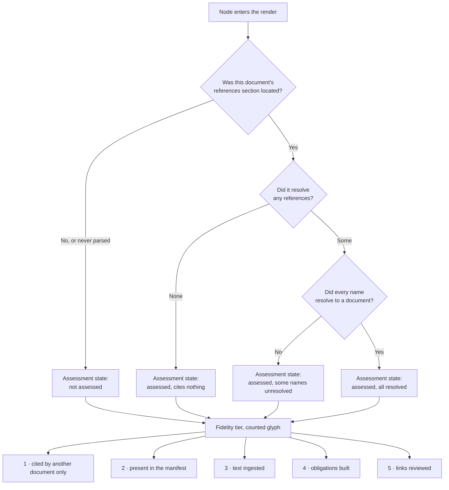
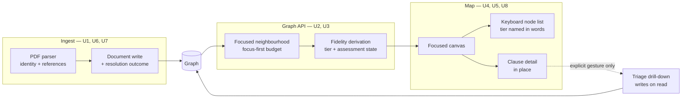

# Dependency Map as Home - Plan

## Goal Capsule

- **Objective:** An analyst adding a document to the corpus sees, without navigating anywhere or waiting on a job, what that document depends on — and can tell at a glance how much the system actually knows about anything it draws.
- **Means:** Make the dependency graph the product's home surface, scoped to one document and its neighbourhood rather than the whole corpus.
- **Product authority:** This plan covers the focused dependency map and its clause-level expansion. Upstream conflict detection and multiple switchable document sets are named as later work and are not active scope. Where this plan and an existing ADR disagree, the ADR wins until superseded — two supersessions are named as prerequisites below and neither is this plan's work.
- **Execution profile:** Backend and frontend change together, but the backend units are independently landable and the frontend depends on them. U1 through U3 can ship without any visible change; the map is only coherent once U4 and U5 land together.
- **Stop conditions:** Stop and raise rather than proceeding if the ADR-039 supersession is refused (U7 has no sound implementation without it), if the render budget cannot keep the focused document's own neighbours whole (R5 becomes unsatisfiable), if a fidelity tier cannot be computed without a second round-trip per node, or if the five tier glyphs prove not separable at the size nodes actually render. That last one has no cheap escape: R11 reserved the channels an implementer would otherwise reach for, and releasing them is the reserver's decision, not a matter of implementation convenience.
- **Who finishes:** `ce-work` or a human implementer working unit by unit in the stated order; the two ADRs are authored separately by the project owner.
- **Open blockers:** Two ADR supersessions gate parts of this plan. ADR-016 must be superseded before clause-level impact runs at interactive speed — the requirements stand without it, only their latency does not. ADR-039 must be superseded before U7 can make an unchanged re-ingest a no-op; that one is a hard gate, because the current decision is the opposite behaviour.

---

## Product Contract

### Summary

Make the dependency graph the home surface, centred on one document and its immediate neighbourhood instead of the full corpus.
Adding a document lands the reader on it with its references drawn, nodes carry how much is known about them, and clause-level detail opens in place with the existing Triage worklist as the drill-down.

### Problem Frame

The product currently requires an analyst to already know the answer to the question it exists to answer.
Every working surface — Triage, Review, Pairings — is reached by choosing a document and an edition pair first, so the tool can only report on exposure someone already suspected. The measured consequence is a Triage screen returning a single row against 133 detected changes, because a change with no reviewed downstream link produces no row at all.

Underneath that, the corpus is far thinner than the interface implies. 474 documents are stored, 23 render by default, and 4 carry text. The graph draws them with one boolean of distinction between them, so a reader cannot tell a document the system has read from one it has only ever seen cited. That is a standing invitation to over-read the product, and it falls hardest on the audience least equipped to catch it.

The cost shape is not slowness, it is misplaced confidence. An analyst who cannot see which parts of the picture are substantiated has no way to weigh what the picture claims.

### Key Decisions

- **The map is home, scoped to one document's neighbourhood rather than the whole corpus.** A focused view is dense and legible at any corpus size, where a 474-node view is mostly empty space. (session-settled: user-directed — chosen over a corpus-management workspace and an impact inspector: structure is what the analyst reads, and a corpus-wide view cannot be made meaningful while 4 of 474 documents carry text.) Governs R5, R6, R12.
- **Model inference moves to an accredited managed service, superseding ADR-016.** Clause-level impact is only worth putting in the interactive path if extraction is not CPU-bound. (session-settled: user-directed — chosen over keeping inference local and adding GPU reservations: local capacity caps throughput at whatever hardware is on hand.) Governs R8.
- **Clause expansion and fidelity grading are v1; upstream conflict detection is v2.** v1 then never has to rule on what an unreviewed contradiction claim is allowed to assert. (session-settled: user-directed — chosen over including conflict detection in v1: a machine claim that one policy contradicts another is a stronger assertion than ADR-014 already declines to let stand unreviewed.) Governs R6, R8.
- **Triage is re-parented as the drill-down from a focused document, not replaced.** Its honesty guarantees survive rather than being rebuilt inside a new surface. (session-settled: user-approved — chosen over absorbing Triage into the map: `unlinked_changes` exists specifically so an empty table cannot read as an all-clear, and rebuilding that in a new surface risks regressing it.) Governs R9.
- **v1 reserves the map's strongest visual encoding for change.** The next version encodes what moved and how far it reached, so v1 does not spend motion or saturation on structural facts. (session-settled: user-directed — chosen over building the focused lens without staging: change-as-figure is the named next step rather than a possibility.) Governs R11.
- **v1 has no corpus-wide entry point, and the staged change encoding is what will answer "where should I look".** A node marked as having moved is itself the answer, so the gap closes by construction later rather than by adding a surface now. (session-settled: user-directed — chosen over a ranked entry list and a full corpus overview: either would reintroduce the corpus-scale view the focused lens exists to avoid.) Governs R12.
- **The analyst is the primary actor; the demonstration audience is a close second.** Where the two conflict, daily working depth wins — but no v1 choice may make the product harder to show convincingly. (session-settled: user-directed — chosen over analyst-only and over demo-primary: honest emptiness has to be presentable, not merely correct.) Governs R6, R10.
- **Adding a document is a foreground operation.** The dependency half of ingest involves no model call, so it resolves inside the request rather than behind a job the reader waits on. Governs R2.
- **An unchanged re-ingest stops being destructive.** Adding a document is now the product's most prominent action, and today re-adding one discards its obligations and reviewed links without saying so. (session-settled: user-directed — chosen over warning before the write, over reporting the loss afterwards, and over accepting the hazard: the accidental re-add is the common case and the safest answer is for it to do nothing at all.) Governs R13.

### Actors

- A1. **Policy analyst** — adds documents, reads dependencies, follows impact downstream. The primary actor: where two requirements conflict, their daily working needs win.
- A2. **Document source parser** — resolves an ingested PDF into an issuance identity and its cited references. Deterministic, no model involved.
- A3. **Managed extraction service** — produces clause-level obligations on an accredited endpoint. Involved only once a reader expands a node.

### Requirements

**Adding a document**

- R1. Completing an ingest places the reader on the map with the newly added document as the focused node, rather than leaving them on a separate screen to navigate from.
- R2. The focused document's outgoing references are drawn in the same interaction that completes ingest, without a background job or a second navigation.
- R3. When a document's references section cannot be located, the map states that its dependencies are unread, per R10.
- R4. When a document cannot be identified as an issuance, ingest fails with a message naming that cause and leaves no node on the map.

**What the map shows**

- R5. The map renders one focused document with its dependency neighbourhood — what it cites and what cites it — expandable outward one degree at a time, rather than rendering the corpus.
- R6. Every node states how much is known about it, distinguishing at minimum: cited by another document only, present in the manifest, text ingested, obligations built, and links reviewed.
- R7. A node whose reference list includes names the corpus could not resolve is visually distinct from one whose references all resolved, and the unresolved names are retrievable from it.
- R8. Selecting a node opens its clause-level detail in place on the map.
- R9. The existing Triage worklist is reachable as the drill-down from a focused document and continues to report unlinked changes as it does today.

**Honesty and staging**

- R10. No node state in the map renders an unknown as a known-empty: absence of an edge, a clause, or a mark never asserts that none exists.
- R11. v1 encodes structural facts using position, shape and label only, leaving motion and saturated colour unused so a later change encoding can claim them.
- R12. The map remains legible without a corpus-wide view: any affordance that depends on seeing all documents at once is out of v1 rather than approximated.

**Preserving what has been built**

- R13. Re-ingesting a document whose source bytes and processing pipeline are both unchanged leaves its chunks, obligations, reviewed links and build record standing, and reports that nothing was done. Any other re-ingest keeps the existing discard-and-rebuild behaviour.
- R14. When an ingest is refused because two different files claim the same edition of the same issuance, the reader is told that specifically, and the map keeps showing whatever it was showing before the attempt.

### Key Flows

- F1. Add a document and read its dependencies
  - **Trigger:** A1 adds a document to the corpus.
  - **Actors:** A1, A2
  - **Steps:** A2 resolves the issuance identity and its cited references; the document is written with its reference edges; the map opens focused on it with those edges drawn and its own fidelity stated.
  - **Outcome:** A1 sees the document and what it depends on without a further action.
  - **Covered by:** R1, R2, R3, R4, R6, R7

- F2. Follow a dependency down to clause level
  - **Trigger:** A1 selects a node on the map.
  - **Actors:** A1, A3
  - **Steps:** The node expands in place to its clause-level detail; where obligations are not yet built, A3 produces them; the Triage worklist for that document is reachable from the expanded node.
  - **Outcome:** A1 moves from structure to specific clauses without leaving the map.
  - **Covered by:** R5, R8, R9

### Acceptance Examples

- AE1. The ten-second test
  - **Covers R1, R2.**
  - **Given** a corpus and a document that has not been added.
  - **When** A1 adds it.
  - **Then** the map is showing that document with its outgoing reference edges drawn, with no further navigation and no job to wait on.

- AE2. References that could not be read
  - **Covers R3, R10.**
  - **Given** a document whose references section cannot be located by A2.
  - **When** ingest completes and the map focuses it.
  - **Then** the node states that its dependencies are unread, and is distinguishable from a document confirmed to cite nothing.

- AE3. A file that is not an issuance
  - **Covers R4.**
  - **Given** a PDF with no recognisable issuance header.
  - **When** A1 attempts to add it.
  - **Then** ingest fails naming that cause, and no node for it appears on the map.

- AE4. A thin neighbour
  - **Covers R6, R10.**
  - **Given** a focused document citing a document the corpus holds only as a cited name.
  - **When** A1 reads the neighbourhood.
  - **Then** the cited-only neighbour is visibly distinct from neighbours whose text has been ingested, and nothing about it implies the system has read it.

- AE5. Re-adding a document that carries reviewed work
  - **Covers R13.**
  - **Given** a focused document whose edition already holds built obligations and reviewed links.
  - **When** A1 adds the identical file again from the picker, with no change to the processing pipeline.
  - **Then** nothing is discarded, the node's stated fidelity is unchanged, and the reader is told the document was already present rather than being shown a successful write.

- AE6. A neighbourhood larger than the map can draw
  - **Covers R5, R10, R12.**
  - **Given** a focused document with more immediate neighbours than the render budget allows.
  - **When** A1 reads the neighbourhood.
  - **Then** the map says it is showing part of the neighbourhood and on what basis it chose, and the omission is never rendered the same way as a document having no further references.

- AE7. A first edition has nothing to compare against
  - **Covers R9, R10.**
  - **Given** a document just added, holding exactly one edition.
  - **When** A1 follows the Triage drill-down from its node.
  - **Then** the drill-down states that there is no earlier edition to compare against, distinctly from Triage running and finding no changes.

- AE8. Two files claiming the same edition
  - **Covers R14.**
  - **Given** an edition already recorded for an issuance and effective date.
  - **When** A1 adds a different file claiming that same issuance and date.
  - **Then** the ingest is refused naming the conflict, no node is created or altered, and the reader's current view is preserved.

- AE9. Nothing appears to cite this document
  - **Covers R5, R10.**
  - **Given** a focused document that no drawn document cites, in a corpus where most documents have never had their references read.
  - **When** A1 reads the neighbourhood.
  - **Then** the map states that the inbound half is limited by documents the system has not read, and an empty set of citers never reads as a finding that nothing depends on this document.

### Success Criteria

- Adding a document and seeing what it depends on is one action with no waiting step.
- A reader who has never used the tool can tell, without instruction, which nodes the system has read and which it has only seen cited.
- No surface in v1 presents an unread or unbuilt state in the same visual language as a confirmed-empty one.
- The map can be shown to a non-user without either overstating what the corpus contains or reading as broken.
- From a document already on the map, an analyst reaches its clauses and its Triage drill-down without leaving the map, and is told plainly where obligations do not yet exist.

<!-- ce-section: work-relationships -->
### How This Work Fits Together

This plan covers the focused dependency map and its clause-level expansion. The breakdown below is the current understanding of the surrounding work, not a committed roadmap; a later plan may revise, split, merge, or discard any of it.

- **Upstream conflict detection** — flagging where one of our clauses contradicts the issuance above it, rather than only where it implements it.
  - Depends on this plan's clause-level expansion as the surface it would render on.
  - Still to decide: what an unreviewed contradiction claim may assert, and whether it needs its own human gate alongside ADR-014's.
- **Change as the map's primary encoding** — encoding what moved and how far it reached, with structure as the substrate.
  - Depends on R11 having kept motion and saturation unspent.
  - Enables the conflict work above to land in a vocabulary that already expresses propagation.
  - Enables the answer to "which document should I look at?", which v1 deliberately leaves unanswered: a node marked as having moved is that answer.
- **Multiple switchable document sets** — maintaining several named collections and choosing the active one.
  - Can proceed independently of this plan.
  - Still to decide: what to call them, since *corpus* already names the in-manifest/external distinction that ADR-002 rests on.
- **The exposure ledger's other moves** — making a worklist row one of our own obligations, ageing unresolved items, and publishing reviewed-against-unreviewed exposure.
  - Shares this plan's motivation and can proceed independently of it.

### Scope Boundaries

**Deferred for later**

- Upstream conflict detection, including any representation of contradiction in the graph.
- Multiple switchable document sets.
- Change-as-primary-encoding on the map.
- Any corpus-wide entry point, ranked list, or overview answering "which document should I look at?".

**Not this plan's work**

- Writing either ADR this plan depends on — the ADR-016 supersession for hosted inference, and the ADR-039 supersession for the unchanged-re-ingest no-op. Both are named as prerequisites and neither is authored here.
- GPU configuration for local development. It is a separate concern and largely moot once inference is hosted.
- Replacing or retiring Review and Pairings.

### Dependencies / Assumptions

- **Prerequisite:** An accepted ADR superseding ADR-016, replacing its blanket prohibition on sending corpus text to a hosted API with an accreditation test. ADR-016 is marked frozen and rejects hosted inference on the grounds that the material "cannot be sent to a third-party API at all"; it does not distinguish an accredited managed service from an unaccredited one.
- **Prerequisite:** An extraction adapter for the chosen managed endpoint. The port exists and currently admits only `null` and `local`. A new adapter needs its own measured floors recorded before it ships — not because the ratchet fails without them, but because it skips: an unmeasured adapter passes a green suite that checked nothing.
- **Prerequisite:** The managed endpoint's served model must satisfy the project's existing US-origin provenance rule, or that allowed set is widened by a recorded supply-chain decision first. That rule is enforced by a test against an explicit set, and its own ADR describes widening the set as a decision argued in review rather than a settings change. This is a third governance gate, distinct from the ADR-016 supersession and from the floors above.
- **Prerequisite:** An accepted ADR superseding ADR-039, permitting an unchanged re-ingest to be a no-op. ADR-039 decided the opposite — that a re-ingest discards the derived layer it invalidates — after rejecting both re-anchoring and refusing the write. It did not consider a no-op on unchanged input, but its rejection of re-anchoring names the hazard the no-op must avoid: the drop exists for the case where the chunker has changed, so an unchanged-source check alone is not sufficient grounds to skip it. R13 is written against that constraint and blocked without the supersession.
- **Assumption:** "Immediately" means inside the ingest interaction, not a job the reader waits on. This holds because the dependency half of ingest involves no model call, and it bounds R2.
- **Assumption:** The corpus manifest and ingested PDFs remain the only sources of reference edges. Nothing in v1 infers a dependency the source document does not state.

### Outstanding Questions

**Deferred to Implementation**

- What R8's in-place clause detail shows while extraction is still running, in the interval before the managed adapter lands. The current path is a queued job that also requires candidate editions to be chosen by hand, so "opens in place" has no honest interim rendering yet. U8 is gated on this being answered, and the safest interim is to expose clause detail only where obligations already exist.
- The exact tie-break when a focused document's own immediate neighbours exceed the render budget, beyond the corpus-before-external ordering KTD2 fixes. The budget rule is settled; which neighbour is dropped first within a tier is not, and it needs a real overflowing document to judge.

### Sources / Research

- `backend/src/policy_grapher/sources/pdf.py` — resolves a PDF into an issuance identity and its cited references as pure functions, with no model or network call. `locate_references` returns an unknown format rather than raising, which is the silent-zero-edges path R3 exists to cover; `extract_document` raises when no issuance header is recognisable, which is the failure R4 covers.
- `backend/src/policy_grapher/ingest.py` — writes `:REFERENCES` edges, and reports attributed reference counts, the list of unresolved reference names, and skipped self-references. The unresolved list is the signal R7 needs.
- `backend/src/policy_grapher/routers/admin.py` — ingest runs inline rather than through the job queue, which is what makes R2 achievable.
- `backend/src/policy_grapher/models.py` — `GraphNode` carries only id, label and an external flag, so R6 has no existing field to populate. `TriageOut.unlinked_changes` carries the guarantee R9 preserves.
- `backend/src/policy_grapher/routers/graph.py` and `backend/src/policy_grapher/config.py` — the graph is corpus-first with a 300-node render cap.
- `docs/specs/adr/ADR-002-external-references-and-corpus-first-graph.md` — decides "ingest everything, filter the view", so a narrower default view is consistent with it and needs no supersession.
- `docs/specs/adr/ADR-015` — the rule R3 and R10 generalise: an empty result must not be readable as an all-clear.
- `docs/specs/adr/ADR-016-embeddings-are-a-port.md` — the prerequisite named above.
- `backend/src/policy_grapher/extraction/__init__.py` — the extraction port, currently admitting `null` and `local` only.
- `docs/specs/adr/ADR-039-a-re-ingest-discards-the-derived-layer.md` — the decision R13 reverses, and the source of the constraint KTD9 is built around. It rejected re-anchoring on the grounds that the drop exists for the changed-chunker case, which is why an unchanged-source check alone is not sufficient to skip the write.
- `frontend/src/views/GraphExplorer.tsx` — the existing graph surface. It already spends node colour and node size on the corpus/external distinction for non-text contrast, and already carries the parallel keyboard list that is the canvas's only accessible surface. Both constrain KTD4.
- **Renderer behaviour, verified against what is installed rather than what is declared.** The manifest declares one version and the lockfile resolves to a later one; plan against the resolved version. Two behaviours shape KTD3: a graph-data change reheats the layout unconditionally, and node positions survive only through object identity, not through matching ids. The library's own progressive-expansion example keeps one persistent node map and mutates it rather than replacing nodes, and the maintainer gives the same answer on the related issues. Camera control exists — centre-on-node and fit-to-nodes with a filter — and the documented idiom is to call it once the layout settles.
- **Perceptual evidence behind KTD4.** Ordinality research finds lightness strongly ordered, hue poorly ordered, and shape not inherently ordered at all — an ordinal needs one form counted or nested, not several distinct badges. Node-link guidance puts on-node encoding at its limit around five attributes, which argues for one glyph carrying the ordinal rather than several weak channels stacked. Texture fails at node scale; opacity collides with the disabled convention.
- **Prior art behind the assessment-state axis.** Nautical charting, radiology reporting and monitoring tools independently converged on the same structure: an explicit not-assessed state that sits outside the quality scale rather than at its bottom. Monitoring practice also documents this plan's exact failure mode — when missing data is not handled explicitly, a previously healthy state simply persists, and silence reads as continued health.

---

## Planning Contract

### Product Contract preservation

Changed: added R13, R14 and AE5-AE8. R13 records the re-ingest no-op the user settled during planning; R14 and the four acceptance examples close failure paths that flow analysis found undefined — a version conflict, a re-add carrying reviewed work, a neighbourhood exceeding the render budget, and a first edition with nothing to compare against. R1-R12, A1-A3, F1-F2 and AE1-AE4 are unchanged in wording and meaning, and every existing `Governs R…` link still points where it did.

### Key Technical Decisions

- KTD1. **A node's fidelity tier is computed at query time; the reference-resolution outcome is persisted because it is a different fact.** All five tiers derive from four signals already in the graph — external membership gives the lowest tier, edition count separates the next two, obligation count the fourth, reviewed-link count the fifth — so storing a tier would create a second source of truth that drifts on every rebuild. The reference-resolution outcome is persisted not because it is a sixth tier but because it belongs to the other axis and no query can recompute it: whether a document's references section was ever located is produced once during parsing and is gone if it is not written down. Reading it as the top of the tier ladder is exactly the collapse the design section forbids. Governs R3, R6, R7.
- KTD2. **The focused view draws the neighbourhood and nothing else, and the render budget is allocated inside it.** Today corpus nodes always survive the cap and externals take what is left. A focused view does not re-rank that list — it replaces it: documents outside the neighbourhood are never admitted at any budget, because at this corpus's size they would always fit and the view would silently become the corpus again. Within the neighbourhood the order is the focused document first, then its corpus neighbours, then its external neighbours. Governs R5, R12.
- KTD3. **Expansion merges into a persistent node-identity map rather than replacing the graph.** The renderer reheats its simulation to full strength on every data change, and position survives only through JavaScript object identity — not through matching ids. Rebuilding node objects per fetch, which is what happens today, re-scatters the entire layout on every expansion. New nodes are seeded near the node that revealed them. Governs R5.
- KTD4. **Fidelity is encoded as a counted glyph, and "not assessed" is a separate marker rather than the bottom of the scale.** Shape carries no inherent order, so an ordinal needs one repeated form counted or filled, not five different badges; hue is ruled out by R11 and reads as poorly ordered anyway; opacity collides with the disabled convention; texture is illegible at node size. The tier is also named in words in the keyboard list, which is the only accessible surface the canvas has. Assessment state sits outside the ladder, following the same shape nautical charts, radiology reporting and monitoring tools all converged on. This decision came closest to warranting a bake-off, and did not qualify: the alternatives were settled by existing perceptual evidence rather than needing development, and the choice lives in a paint callback that is cheap to reverse. Governs R6, R7, R10, R11.
- KTD5. **Focus is carried in the URL, and browser history is the back path.** R1 requires landing on a specific document, which is only durable across reload and sharing if the focus is addressable. It also supplies the back behaviour the map otherwise lacks, since the existing "collapse to corpus" control is exactly the corpus-wide affordance R12 removes. Governs R1, R5.
- KTD6. **Selecting a node inspects it; moving focus is a separate explicit control that lives inside the opened node detail.** These are two different intents that the current click handler performs at once — it both selects and re-fetches the neighbourhood around the clicked node. R8 needs selection to leave focus where it is; R5 needs a way to walk outward. Putting the focus action inside the node's opened detail, rather than making it a second canvas gesture, is what keeps both intents reachable identically from a canvas click and from the keyboard list — the canvas has no accessible surface of its own, so a canvas-only second gesture would hand sighted readers a capability nobody else can reach. Governs R5, R8.
- KTD7. **Triage is entered only by an explicit gesture.** The triage route runs a diff inside a write transaction, so any prefetch, hover, or render-time call would silently write derived nodes on every interaction. Governs R9.
- KTD8. **The standalone Ingest screen stays; R1 adds navigation on success rather than removing a destination.** Every route is asserted to have exactly one navigation link, and removing the screen would break that contract for no gain. Governs R1.
- KTD9. **The unchanged-re-ingest no-op keys on the source checksum and a recorded pipeline stamp covering everything between the bytes and the stored chunks.** The checksum covers the source bytes only, so it cannot tell whether the chunks standing now are the chunks the current pipeline would produce. That gap is wider than the chunker: chunk content also depends on the PDF text extraction feeding it, and that dependency is floored with no upper bound, so an upgrade changes the text without touching any code in this repo. A stamp naming only the chunker would let that upgrade pass as unchanged and leave obligations anchored to text the pipeline no longer reads — the outcome ADR-039 refused re-anchoring to avoid, reached by a different route. The stamp is therefore derived from the whole path rather than hand-maintained, so a dependency bump invalidates it without anyone remembering to. (session-settled: user-directed — chosen over warning before the write, over reporting the loss afterwards, and over accepting the hazard: the accidental re-add is the common case and doing nothing is the safest answer.) Governs R13.

### High-Level Technical Design

How a node's rendering is decided. The branch on the left is the honesty rule R10 states; the ladder on the right is R6's ordinal. They are separate axes, and a node always has a value on both.

The two axes are deliberately not collapsed into one scale. A document at tier 5 whose references were never located is a real state, and it must not render as a document at tier 5 that genuinely cites nothing.

The assessment axis is defined only from the third tier upward, where the parser has actually seen the document. Below that the tier already says the system has never read it, so a second mark repeating that would be painted on almost every node in the corpus while distinguishing none of them — and the lowest tier is already double-encoded by the existing colour and size treatment. R10 still holds at those tiers: the tier itself is the statement that nothing has been read.

Where the work lands, and which way the data moves. The dashed edge is the one that must never fire as a side effect.

Two properties this arrangement is chosen to hold. The fidelity derivation sits in the same query as the neighbourhood, so no node costs a second round trip. And the only path that writes on a read is reachable solely through a deliberate action, never through rendering or hovering.

### Assumptions

- The pipeline version R13 compares against does not exist yet and is introduced by U1. Treating an absent stamp as "different" makes the first re-ingest after this ships behave exactly as it does today, which is the safe default.
- A focused document's immediate neighbourhood fits the render budget in the common case. AE6 covers the overflow, but the tie-break within a tier is deferred to implementation because it needs a real overflowing document to judge.
- Clause-level detail is shown only where obligations already exist until the managed adapter lands. F2's "where obligations are not yet built, A3 produces them" describes the end state, not the interim.

### Sequencing

Three orderings are load-bearing rather than merely convenient.

1. **U1 before U3.** The reference-resolution outcome must have a persistent home before any surface claims to report it. Shipping the fidelity UI first would make AE2's guarantee true only until the next page load — worse than today, where the ingest response at least tells the truth once.
2. **U2 lands atomically, not staged.** Flipping the default view to a focused neighbourhood while leaving the cap allocation corpus-first produces a view where unrelated corpus documents crowd out the neighbours the focus exists to show. That intermediate state is actively misleading, not merely incomplete.
3. **U4 and U5 land together.** A focused map without fidelity encoding draws thin and substantiated documents identically, which is the specific failure the Problem Frame names.
4. **U7 ships before U6, and if the ADR-039 supersession is refused U6 is held with it.** U6 promotes adding a document to the product's headline action; U7 is what stops that action discarding an hour of extraction and the reviewed links on top of it. Shipping the promotion without the protection raises exposure to the exact hazard R13 exists to remove, and nothing in U6's own dependencies would otherwise stop it landing first.

### Risks & Dependencies

- **The graph tests assert corpus-wide totals as the default response.** They pin exact node and edge counts for the corpus-first view, so U2 rewrites them rather than re-targeting them. A reviewer should expect that diff and read it as intended, not as a regression.
- **The home surface currently has no failure state worth the name.** Any fetch rejection collapses the whole view to an alert with no retry and no way onward. Tolerable when the graph was one destination among eight; not tolerable once it is home. U4 carries the fix.
- **The renderer is a single-maintainer library with no formal releases.** The installed version is ahead of what the manifest declares, and behaviour must be verified against what is installed rather than what is pinned.
- **The custom node painter runs once per node per frame.** Anything measured, allocated, or branched inside it is paid continuously. Glyph geometry is precomputed per tier, not derived per frame.
- **This plan depends on a decision to send controlled unclassified information to a managed service.** That is the substance of the ADR-016 supersession, and it is a compliance risk rather than a technical one: the accreditation of the chosen endpoint is what makes it lawful, and nothing in this plan verifies that. If the supersession lands without naming an accreditation standard, the plan's latency assumption holds while its legal basis does not.
- **Two units add persisted fields to existing records.** Neither needs a backfill, because both treat an absent value as the honest "unknown" rather than as a default — but that only holds if the absent case is read as unknown everywhere it is read, which is why it is a named test scenario in both units rather than an implementation detail.
- **R11's reservation is a cost v1 pays for an option that may never be exercised.** Holding motion and saturated colour back forces the fidelity signal onto a counted glyph whose separability no test can settle, and the work that would claim those channels is explicitly described as a current understanding a later plan may discard. If that work is not built, the response is to release the reserved channels to fidelity — the encoding lives in a paint callback, so reversing it is cheap. Releasing them is a decision for the person who reserved them, not for whoever is implementing under schedule pressure.
- **The supersession this plan asks for must authorise what the no-op actually does.** The hazard is easiest to describe as a chunker that changed, but the stamp has to cover the whole path from source bytes to stored chunks. An ADR accepted on the narrower framing would leave the shipped behaviour outside what it decided.

### System-Wide Impact

- The graph response gains fields that the frontend type mirrors one-to-one, and the frontend gate type-checks before any test runs — so the API change and its consumers land in the same unit or the suite fails wholesale.
- `GET /triage` remains a GET that writes. This plan does not fix that, and KTD7 exists to keep the new surface from making it worse.
- Ingest gains a no-op path. Anything that assumed a successful ingest always rewrote chunks — including tooling and fixtures — must tolerate a success that changed nothing.

---

## Implementation Units

### U1. Persist what ingest learned about a document's references

- **Goal:** Give the reference-resolution outcome a durable home, so the map can state it on every visit rather than only in the response to the write.
- **Requirements:** R3, R7, R10; supports R6. Realizes the parse-and-write steps of F1.
- **Dependencies:** none.
- **Files:** `backend/src/policy_grapher/ingest.py`, `backend/src/policy_grapher/sources/document.py`, `backend/src/policy_grapher/models.py`, `backend/tests/test_ingest.py`
- **Approach:**
  1. Carry the parser's reference-section outcome and its unresolved names through to the document write rather than only into the HTTP result.
  2. Record them on the document's stored record, alongside the existing identity fields.
  3. Treat a document that has never been parsed as distinct from one parsed with no section found — absent and negative are different values, per R10.
- **Patterns to follow:** the existing document write in `ingest.py`, which already composes its parameters from the parsed result in one transaction.
- **Test scenarios:**
  - Covers AE2. A document whose references section cannot be located stores an outcome saying so, and that outcome survives re-reading the document without re-ingesting.
  - A document whose references all resolve stores an outcome distinguishable from both of the above.
  - A document with some unresolved names stores those names, and they are readable back in full rather than as a count.
  - A document ingested before this field existed reads back as never-parsed rather than as confirmed-empty.
- **Verification:** the stored outcome for a document is readable in a second, separate request after ingest completes, and the three cases are distinguishable from one another.

### U2. Make the neighbourhood the graph's unconditional node set

- **Goal:** Return one document's dependency neighbourhood as the graph's primary answer, with the render budget allocated to the focus first.
- **Requirements:** R5, R12.
- **Dependencies:** none.
- **Files:** `backend/src/policy_grapher/graph.py`, `backend/src/policy_grapher/routers/graph.py`, `backend/tests/test_graph.py`
- **Patterns to follow:** the existing expand mode already resolves a document and adds its external neighbours; this unit promotes that shape from an additive option to the primary answer rather than inventing a new query. The existing budget slice is the code to restructure, not to copy.
- **Approach:**
  1. Add a focused mode that resolves the document, its outbound citations and its inbound citers, to a requested depth defaulting to one.
  2. Allocate the budget inside the neighbourhood only — focused document, then corpus neighbours, then external neighbours — and admit no document from outside it. A second tier that admitted the wider corpus would always fit at this corpus's size, so the focused view would render as the corpus view with extra steps.
  3. Report when the neighbourhood was truncated and on what basis, so the surface can satisfy AE6 rather than inferring it.
  4. Keep the existing corpus-wide mode reachable for the tests and callers that still use it; this unit changes which mode is primary, not which modes exist.
- **Execution note:** the existing graph tests encode corpus-first budget allocation as their premise. Rewrite them to assert the new allocation deliberately rather than adjusting numbers until they pass.
- **Test scenarios:**
  - A focused document returns itself, everything it cites, and everything citing it, and nothing else at depth one.
  - Covers AE6. A neighbourhood larger than the budget returns the focused document and a truncation report, and never silently returns a short list.
  - The focused document itself is never dropped by the budget.
  - A depth of two includes the neighbours' neighbours and still allocates the focus first.
  - An unknown slug is refused distinctly from a known slug with no neighbours.
- **Verification:** a focused request for a document with many citers returns the focus intact and says what it omitted; a corpus-wide request still answers for existing callers.

### U3. Report each node's fidelity on the graph

- **Goal:** Give every node the tier and assessment state the map needs, computed in the same query rather than fetched per node.
- **Requirements:** R6, R7, R10. Supplies the data AE6 and AE9 are stated against.
- **Dependencies:** U1, U2.
- **Files:** `backend/src/policy_grapher/graph.py`, `backend/src/policy_grapher/models.py`, `frontend/src/api/types.ts`, `frontend/src/views/GraphExplorer.test.tsx`, `backend/tests/test_graph.py`
- **Approach:**
  1. Widen the node queries to carry edition count, obligation count and reviewed-link count alongside the existing external flag.
  2. Derive the tier from those counts in one place, so the ladder is defined once.
  3. Carry the stored reference-resolution outcome from U1 through as the assessment state, as a field separate from the tier.
  4. Carry, alongside the per-node fields, two neighbourhood-level facts the map needs to stay honest: U2's truncation report, and a count of corpus documents whose own references have never been read — documents whose outgoing edges therefore come from a manifest row naming them rather than from reading the document.
  5. Mirror every new field in the frontend type in the same unit, and update the existing graph fixtures that construct node literals — the frontend gate type-checks the whole source tree before a single test runs, so a fixture missing a required field fails the suite wholesale.
- **Patterns to follow:** the document listing already composes per-document counts through optional matches in a single query.
- **Test scenarios:**
  - A document held only as a cited name reports the lowest tier.
  - A document present but with no ingested edition reports the manifest tier, distinctly from the above.
  - A document with text but no obligations reports the ingested tier.
  - A document with obligations but no reviewed links reports the obligations tier.
  - A document with reviewed links reports the highest tier.
  - Covers AE2. Tier and assessment state vary independently: a top-tier document whose references were never located reports both facts.
  - A focused response reports how many corpus documents have never had their references read, so the map can qualify an empty set of citers.
  - A truncated neighbourhood reports that it was truncated, and on what basis.
  - The existing graph fixtures carry a tier and an assessment state, and the frontend type build passes.
  - Node count and identity are unchanged by adding these fields.
- **Verification:** every node in a focused response carries a tier and an assessment state, and a document moved up a tier by a rebuild reports the new tier without any other change.

### U4. Focus, camera and a home surface that survives failure

- **Goal:** Make the map open on a named document, keep its layout stable as it expands, and stay usable when a request fails.
- **Requirements:** R1, R5, R12.
- **Dependencies:** U2.
- **Files:** `frontend/src/views/GraphExplorer.tsx`, `frontend/src/api/client.ts`, `frontend/src/views/GraphExplorer.test.tsx`
- **Approach:**
  1. Read the focused document from the URL so the view is addressable, shareable and reversible by browser history.
  2. Define what the route renders when the URL names no document. This is the app's landing state on every cold start and every navigation click, not an edge case. Render the shared empty state saying no document is focused, pointing at the two existing ways to choose one. Never fall back to the corpus-wide mode U2 keeps reachable — that is the view R12 removes, and it is the fallback an implementer reaches for by default.
  3. Hold nodes in an identity map across fetches, merging new arrivals and reusing existing objects so positions survive expansion; seed new nodes near the node that revealed them.
  4. Centre on the focused node and fit the view to the neighbourhood once the layout settles, rather than on mount.
  5. Name the current focus in the keyboard list as well as on the canvas. Camera centring is a signal only sighted readers receive, and selecting and focusing now have different consequences, so the list must say which document is focused in the same way it says a node's tier.
  6. Replace the hand-written renderer handle and its cast with the library's own exported method type, which covers the camera calls this unit needs.
  7. Give a failed or empty graph load a state that keeps the reader oriented and offers a way onward, rather than replacing the home surface with an alert.
- **Patterns to follow:** the existing resize-observer callback ref, which is the established fix for canvas sizing here; the existing shared empty-state component for the corpus-is-empty case.
- **Test scenarios:**
  - Opening the map with a document named in the URL renders that document focused without any interaction.
  - Opening the map with no document named renders the shared empty state offering the ways to choose one, and never the corpus-wide view.
  - The keyboard list names which document is currently focused, distinctly from the others present in the neighbourhood.
  - Expanding a neighbourhood keeps already-drawn nodes at their positions rather than re-scattering them.
  - Browser back returns to the previously focused document.
  - A focused slug that no longer exists renders a stated not-found condition with a way onward, not a blank surface.
  - A failed graph request renders an error that keeps navigation reachable and offers a retry.
  - The keyboard node list stays in step with the canvas after an expansion.
- **Verification:** focus, expand, then back returns to the prior view with the layout intact; killing the backend leaves the home surface navigable.

### U5. Encode fidelity and assessment state on the map

- **Goal:** Make how much is known about a document legible at rest, in a form that survives low vision, colour blindness and the reserved channels.
- **Requirements:** R6, R7, R10, R11.
- **Dependencies:** U3, U4.
- **Files:** `frontend/src/views/GraphExplorer.tsx`, `frontend/src/styles.css`, `frontend/src/views/GraphExplorer.test.tsx`
- **Approach:**
  1. Paint a counted glyph per node for the tier, precomputing the geometry per tier rather than deriving it per frame.
  2. Paint the assessment state as a separate mark, not as a dimmer version of the tier, and only from the third tier upward where the axis carries information.
  3. Mark a node whose neighbours were omitted by the budget distinctly from one that has no further references, and state at the neighbourhood level that the view is partial. Without this the truncation R10 forbids renders exactly like completeness.
  4. State at the neighbourhood level how complete the inbound half is — how many corpus documents have never had their own references read, so what they cite is known only from their manifest rows. On this corpus that is nearly all of them, so a thin "what cites this" half means far less than it appears to until it is said. Note what this must not say, because a first implementation said it and it is false: these documents are not silent. Every one of them can be drawn citing something, because its manifest row names what it cites. The limit is that their citations are only as complete as a manifest is — not that they have none, and not that they cannot appear as citers.
  5. Keep the clickable area in step with whatever the node now draws, or clicks land on the wrong node.
  6. Name the tier, the assessment state and the partial-neighbourhood condition in words in the keyboard list, which is the only surface a screen reader reaches.
  7. Leave motion and saturated colour unused, per R11.
- **Patterns to follow:** the existing label painter is the model for a cheap per-frame draw — a constant-derived font and two draw calls, with the halo stroke behind the fill. The existing node-size and colour constants carry their contrast measurements in comments beside them; the glyph's measurements belong in the same form, beside the value, not in a commit message.
- **Execution note:** verify the glyph against the existing corpus and external node fills for non-text contrast before settling its geometry; the current fills were chosen to clear that bar and the glyph sits on top of them.
- **Test scenarios:**
  - Covers AE4. A cited-only neighbour and an ingested neighbour are distinguishable without reference to colour.
  - Covers AE2. A node whose references were never located is distinguishable from one confirmed to cite nothing.
  - A node carrying both a tier glyph and an assessment mark reads as two distinct facts rather than one blended mark.
  - A lowest-tier node draws its tier glyph and no separate assessment mark.
  - Covers AE6. A node whose neighbours were omitted by the budget is distinguishable from one with no further references, and the view says it is partial.
  - Covers AE9. A neighbourhood whose inbound half is limited by unread documents says so, rather than rendering as a document nothing cites.
  - Each of the five tiers is named in words in the keyboard list.
  - A node with unresolved reference names exposes those names.
  - Clicking a node with a tier glyph selects that node and not a neighbour.
  - No node state introduces motion.
- **Verification:** a corpus containing one document at each tier renders five distinguishable nodes, and each is identifiable from the keyboard list alone.

### U6. Land on the map when a document is added

- **Goal:** Close the gap between adding a document and seeing it, which is the plan's acceptance test.
- **Requirements:** R1, R2, R13's reader-facing half, R14. Completes F1 — this is the step that closes the gap between the write and the reader seeing it.
- **Dependencies:** U4, U7. U7 defines the no-op response this unit has to render; without it this unit would ship an ingest screen that reports a skipped write as a successful one with nothing in it.
- **Files:** `frontend/src/views/Ingest.tsx`, `frontend/src/api/types.ts`, `frontend/src/views/Ingest.test.tsx`
- **Patterns to follow:** the ingest screen's existing result rendering is what needs a second shape, not a replacement — today it reports a write with its counts, and a skipped write has no counts to report. Note that document routes are composed by hand at each call site rather than through a shared constructor, so this unit composes the map's URL the same way; there is nothing to reuse.
- **Approach:**
  1. On a successful ingest, navigate to the map focused on the returned document. The response already carries the slug, so no backend change is needed for navigation.
  2. Render a skipped write as its own outcome: the document was already present and nothing was done. It must not render as a successful write whose counts happen to be zero, which is what today's result shape would produce and what AE5 forbids.
  3. Keep the ingest result reachable rather than discarding it — what was refused and what went unresolved is the reader's only account of the write.
  4. Report a refused conflicting edition as that specific condition, and leave the reader's current view in place.
  5. Leave the screen in the navigation; this unit adds a destination on success, it does not remove one.
- **Test scenarios:**
  - Covers AE1. A successful ingest leaves the reader on the map with the new document focused.
  - Covers AE5. Re-adding an unchanged document reports that it was already present and nothing was done, shows no write counts, and still lands the reader on that document's map.
  - Covers AE8. A conflicting edition is refused with that cause named, and no navigation occurs.
  - Covers AE3. A file that is not an issuance is refused with that cause named, and no navigation occurs.
  - The unresolved reference names from the ingest remain readable after the navigation.
- **Verification:** adding a document moves the reader to the focused map in one action, and each refusal names its own cause without leaving the screen.

### U7. Make an unchanged re-ingest do nothing

- **Goal:** Stop the product's most prominent action from discarding reviewed work when nothing has changed.
- **Requirements:** R13.
- **Dependencies:** U1.
- **Files:** `backend/src/policy_grapher/ingest.py`, `backend/src/policy_grapher/versions.py`, `backend/src/policy_grapher/models.py`, `backend/src/policy_grapher/links/rebuild.py`, `backend/tests/test_ingest.py`
- **Patterns to follow:** the edition merge already compares a stored checksum against a presented one and refuses on mismatch; the stamp comparison is the same shape, differing in that a match short-circuits rather than raising. The build record is the precedent for a derived fact stored on an edition and cleared when it stops being true.
- **Approach:**
  1. Stamp the pipeline onto the edition wherever its chunks are written. Ingest is not the only such path — a rebuild re-reads the source and rewrites chunks too, and an edition re-chunked there would otherwise read as stale on the next unchanged re-add, losing exactly the derived work this unit exists to protect. The stamp is an invariant on chunks, so it belongs with every write of them.
  2. Derive the stamp from the installed pipeline rather than a constant someone must remember to bump. A hand-maintained version gives the no-op a silent failure mode no test in this unit would catch.
  3. Skip the chunk-and-derived-layer rewrite when both the source checksum and the stamp match, and report that nothing was done.
  4. Keep the document write, its reference edges and U1's reference-resolution outcome outside the skip — they are refreshed on every ingest. Otherwise a document whose references were once unreadable could never be re-read, and the map would keep asserting an unknown that had since become knowable.
  5. Treat an absent stamp as a mismatch, so editions written before this exists behave exactly as they do today.
  6. Leave every other re-ingest path untouched — this narrows when the discard happens, it does not remove it.
- **Execution note:** this unit is blocked until ADR-039 is superseded. The current decision is the opposite behaviour, and its reasoning names the changed-chunker hazard this stamp exists to detect.
- **Test scenarios:**
  - Covers AE5. Re-ingesting an identical file with an unchanged pipeline leaves obligations, reviewed links and the build record standing, and says nothing was done.
  - Re-ingesting an identical file after any part of the pipeline changes — including the text-extraction dependency, with no code change in this repo — performs the full discard and rewrite.
  - Re-ingesting a changed file with an unchanged pipeline performs the full discard and rewrite.
  - An edition with no recorded stamp is rewritten rather than skipped.
  - An edition re-chunked by a rebuild is skipped, not rewritten, by a following unchanged re-ingest.
  - A re-ingest whose parser now locates a references section that was previously unreadable updates the stored resolution outcome, while obligations and reviewed links stand.
  - A skipped re-ingest leaves the node's reported fidelity tier unchanged.
- **Verification:** a document with reviewed links, re-added unchanged, reports the same tier before and after and retains its links.

### U8. Open clause detail on the focused node

- **Goal:** Let a reader move from structure to specific clauses without leaving the map.
- **Requirements:** R8, R9. Realizes F2 end to end.
- **Dependencies:** U4, U5.
- **Files:** `frontend/src/views/GraphExplorer.tsx`, `frontend/src/views/Triage.tsx`, `frontend/src/api/client.ts`, `frontend/src/views/GraphExplorer.test.tsx`
- **Patterns to follow:** Triage already defends against the no-earlier-edition case by excluding the oldest edition from its picker and explaining why — reuse that wording rather than writing a second explanation. The document detail view is the existing precedent for rendering an edition's obligations.
- **Approach:**
  1. Separate the two gestures per KTD6: selecting a node opens its detail and leaves focus where it is; moving focus is a single action inside that opened detail, reached identically from a canvas click and from the keyboard list.
  2. Show the focused document's obligations in place where they exist, and state plainly where they do not, rather than implying they are loading.
  3. Offer the Triage drill-down as an explicit action, pre-filled from the focused document, and never fetch it as a side effect of rendering or hovering.
  4. Where the document has fewer than two editions, say there is nothing to compare against rather than presenting a control that cannot run. Most nodes on a focused map have no editions at all rather than one, so a check written for the single-edition case alone would leave a bare surface on the common node.
- **Execution note:** the interim rendering for a document with no obligations yet is deferred; until the managed adapter lands, show clause detail only where obligations already exist and say so where they do not.
- **Test scenarios:**
  - Selecting a node opens its detail without changing which document is focused.
  - The focus control moves focus and redraws the neighbourhood around the new document.
  - Covers AE7. A document with a single edition offers no runnable Triage drill-down and states why, distinctly from Triage finding no changes.
  - A document with no editions at all states the same thing for the same reason, rather than rendering a bare surface.
  - A document with several editions offers the drill-down pre-filled with that document.
  - No triage request is issued by hovering, selecting, or rendering — only by the explicit action.
  - A document with no obligations states that, rather than rendering an empty clause list.
- **Verification:** selecting and focusing are separately observable; no triage write occurs until the explicit action is taken.

---

## Verification Contract

- **Backend:** `cd backend && uv run pytest`. Use `uv run pytest -m "not integration"` to skip the container-backed tests during iteration, but the full run is the gate.
- **Frontend:** `cd frontend && npm test`. This runs lint at zero tolerance for warnings, then a full type build, then the tests — a type change that is not mirrored everywhere fails before any test executes.
- **The graph tests are rewritten, not adjusted.** They currently assert corpus-first budget allocation as the default; U2 changes that premise, so their new assertions must state the focus-first allocation deliberately.
- **The extraction ratchet does not fail an unmeasured adapter — it skips, loudly.** With no recorded floors it announces that the gate did not run rather than failing the suite, and the one test that does fail on a missing entry only ever examines the local adapter. A managed adapter can therefore ship unmeasured against a green suite. Widening that test past its hardcoded local adapter is part of the managed adapter's prerequisite work, not an afterthought.
- **The graph suite is integration-marked in full**, so the focus-first allocation U2 rewrites has no signal in the faster no-integration run. A developer iterating without a database container gets no feedback on U2's core behaviour until the full gate runs.
- **Accessibility is asserted, not inspected.** Tier and assessment state must be reachable by accessible name from the keyboard list, in the same style the existing graph tests use.
- **Manual check the tests cannot make:** open the map at each of the five tiers and confirm the glyphs are separable at the size nodes actually render, including with the canvas zoomed out far enough to suppress labels. Check the tier glyph against the assessment mark on the same node as well as the tiers against each other — those two marks compete for the only channel left once colour, saturation, opacity and texture are ruled out, and a pass on the tiers alone does not establish that the two marks read as two facts. Failing this check is a stop condition, not a licence to spend a reserved channel.

## Definition of Done

- R1-R14 hold, and AE1-AE9 are each covered by a named test.
- A document added from the picker leaves the reader on the map, focused, with its references drawn and its fidelity stated — the plan's acceptance test, verified by hand as well as by test.
- No node state renders an unknown as a known-empty, at any tier, on first render or after a reload.
- Re-adding an unchanged document preserves its obligations, reviewed links and build record.
- Both ADR supersessions are either accepted or the units depending on them are explicitly not shipped: U7 is blocked on ADR-039, and U8's interim behaviour is stated rather than assumed.
- The graph test suite asserts the focus-first allocation as its premise, and no test was adjusted numerically to pass.
- Both suites pass in full, with the frontend's lint and type gates clean.
- Abandoned approaches are removed. A long implementation run accumulates experiments; the diff that ships carries none of them.
